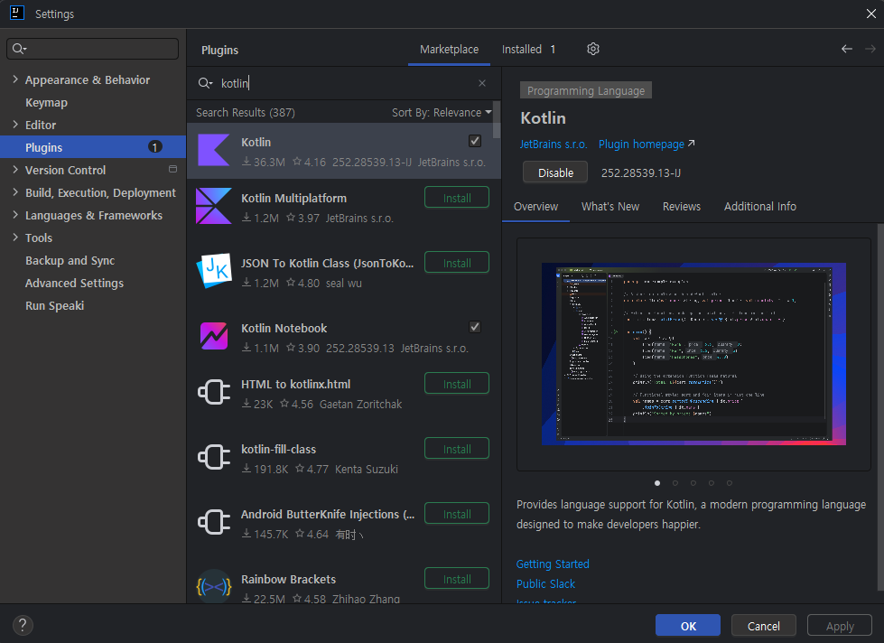
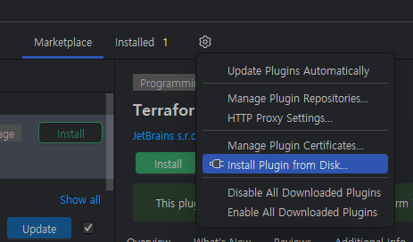
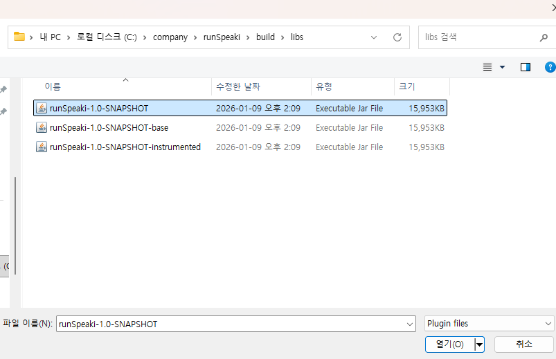
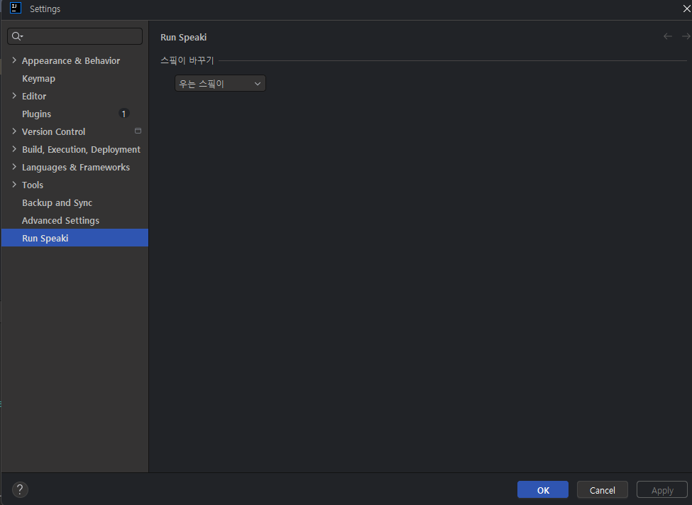

# 스피키와 코딩하기

인텔리제이에서 스피키와 코딩할 수 있는 플러그인입니다.

## 사용 방법

먼저, 해당 레포를 clone하여 gradle build task를 실행한다.

Settings > Plugins 탭에 들어간다.

톱니바퀴 버튼을 누르고 

생성된 jar 파일 선택 후, IDE 재시작

## 모양 바꾸기

위 셀렉트박스에서 변경할 수 있습니다. 총 4개의 형태가 있습니다

## 추가할 기능들
- 사진을 사용자가 직접 커스텀 수 있도록 해야 함
- 창 크기에 따라 동적으로 캐릭터 위치가 조정되도록 해야 함
> [이슈는 여기로]("https://github.com/KimTaeO/run-speaki/issues")

## etc
- 마켓플레이스에 올리기 귀찮아서 깃헙에 먼저 올립니다.
